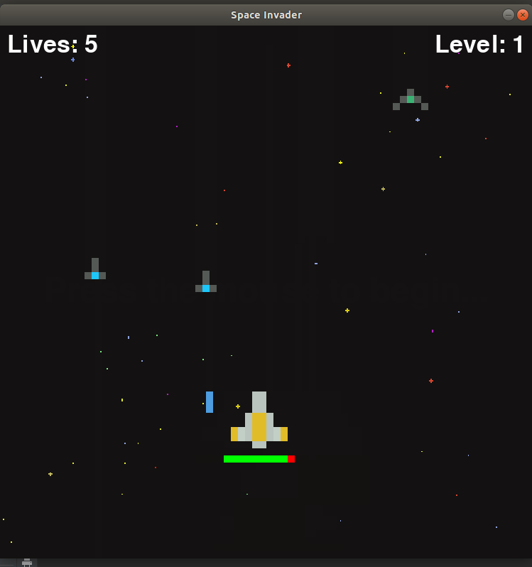

# Space Invader

> A simple Space invader game made in Pygame

---

### About the project
content section down bellow

- [Description](#description)
- [Requirements](#Requirements)
- [References](#references)
- [Author Info](#author-info)

---

## Description

Space Invader is a classic 2d game to develop to polish your object-oriented designing software designing skills. Developed using 'Python3' and th 'pygame' module.
#### Technologies

- Python 3.6
- pygame 1.9.6

[Back To The Top](#read-me-template)

---

## Requirements
- Python 3 or above
- pygame 
- VsCode text editor

[Back To The Top](#read-me-template)

---

## References
[Space Invader Wikipedia](https://en.wikipedia.org/wiki/Space_Invaders)

[python3.7](https://www.python.org/downloads/)

[Pygame docs](https://www.pygame.org/docs/)

[VsCode](https://code.visualstudio.com/download)

[Back To The Top](#read-me-template)

---

## Author Info

- Contact - [Abhik Mitra](abhik.11812368@gmail.com)

[Back To The Top](#read-me-template)

